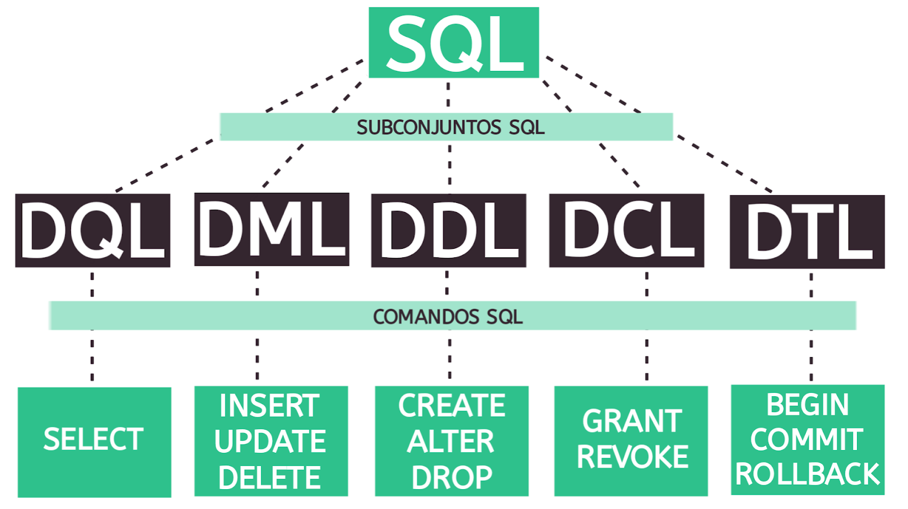
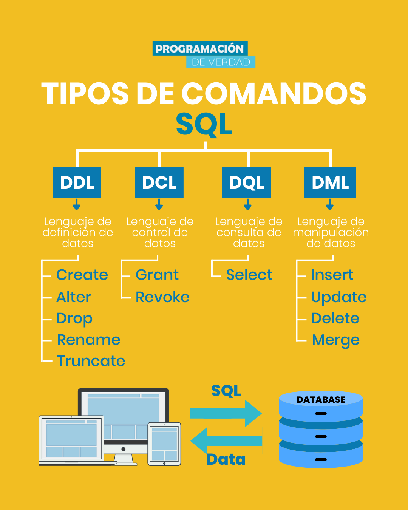

# SQL DQL (Data Query Language)
Aunque no es una categoría oficial de SQL, DQL es un término que se usa para describir el uso de la categoría DML de SQL para realizar consultas de datos (SELECT). Puesto que vamos a tratar mucho las consultas, dejaremos esta categoría en el curso. Ya que realmente, SELECT, manipula datos, pero en las salidas que devuelve, no los modifica en la base de datos. Las otras tres palabras de DML si que modifican datos sobre las bases de datos.

DQL (Data Query Language) y SQL (Structured Query Language) son lenguajes de consulta utilizados en bases de datos relacionales.

* SQL es un lenguaje estándar utilizado para administrar y manipular datos en bases de datos relacionales. Permite realizar consultas, insertar, actualizar y eliminar datos, así como también definir y modificar la estructura de las tablas en una base de datos.

* DQL, por otro lado, es un subconjunto del lenguaje SQL que se utiliza específicamente para consultas de datos. Es utilizado para recuperar información de una base de datos sin modificar los datos existentes. DQL se utiliza para realizar consultas selectivas, filtrar datos y ordenarlos según los criterios definidos.
  
# SQL DML - Data Manipulation Language
DML es una categoría de SQL que se utiliza para manipular los datos almacenados en una base de datos. Incluye comandos como SELECT, INSERT, UPDATE y DELETE, que se usan para seleccionar, agregar, modificar y eliminar datos de una base de datos.
SQL DML (Data Manipulation Language) es un subconjunto de SQL que se utiliza para realizar operaciones de manipulación de datos en una base de datos. Las sentencias DML se utilizan para insertar, actualizar y eliminar datos en las tablas de una base de datos.

Algunas de las sentencias DML más comunes son:

__INSERT__: Se utiliza para insertar nuevos registros en una tabla. Puede insertar uno o varios registros a la vez.
Ejemplo de código:

> INSERT INTO tabla (columna1, columna2, columna3) VALUES (valor1, valor2, valor3);

__UPDATE__: Se utiliza para actualizar los valores de uno o varios registros en una tabla.
Ejemplo de código:

> UPDATE tabla SET columna1 = nuevo_valor WHERE condicion;
 
__DELETE__: Se utiliza para eliminar uno o varios registros de una tabla.
Ejemplo de código:

> DELETE FROM tabla WHERE condicion;

Aquí tienes algunos enlaces que puedes consultar para obtener más información sobre SQL DML:

W3Schools: https://www.w3schools.com/sql/sql_dml.asp
Tutorialspoint: https://www.tutorialspoint.com/sql/sql-data-manipulation.htm
Microsoft SQL Server Documentation: https://docs.microsoft.com/en-us/sql/t-sql/data-manipulation/data-manipulation-language-dml-statements?view=sql-server-ver15
Recuerda que el código puede variar dependiendo del sistema de gestión de bases de datos que estés utilizando.

# SQL DDL (Data Control Language)
DDL (Lenguaje de Definición de Datos) es un subconjunto de SQL (Structured Query Language) utilizado para definir y gestionar la estructura de una base de datos. Las declaraciones DDL se utilizan para crear, alterar y eliminar objetos de base de datos como tablas, vistas, índices y esquemas.

Algunas declaraciones SQL DDL comúnmente utilizadas incluyen:

1. CREATE: Se utiliza para crear un nuevo objeto de base de datos, como una tabla, vista, índice o esquema.
Ejemplo: CREATE TABLE Empleados (id INT, nombre VARCHAR(50), edad INT);

1. ALTER: Se utiliza para modificar la estructura de un objeto de base de datos existente.
Ejemplo: ALTER TABLE Empleados ADD COLUMN salario DECIMAL(10,2);

1. DROP: Se utiliza para eliminar un objeto de base de datos existente.
Ejemplo: DROP TABLE Empleados;

1. TRUNCATE: Se utiliza para eliminar todos los datos de una tabla existente sin eliminar la estructura de la tabla.
Ejemplo: TRUNCATE TABLE Empleados;

1. RENAME: Se utiliza para cambiar el nombre de un objeto de base de datos existente.
Ejemplo: RENAME TABLE Empleados TO Personal;

1. COMMENT: Se utiliza para agregar comentarios a un objeto de base de datos.
Ejemplo: COMMENT ON TABLE Empleados IS 'Esta tabla almacena información de empleados';

Estos son solo algunos ejemplos de declaraciones SQL DDL. DDL es una parte esencial de SQL, ya que permite a los usuarios crear, modificar y eliminar objetos de base de datos para definir y gestionar la estructura de la base de datos.

# SQL DCL (Data Control Language)
DCL (Data Control Language) en español se traduce como Lenguaje de Control de Datos. Es un subconjunto de SQL que se utiliza para controlar el acceso y los permisos de los usuarios en una base de datos. Algunos comandos DCL comunes incluyen:

1. GRANT: otorga permisos a un usuario o rol específico para acceder a objetos de la base de datos.
1. REVOKE: revoca los permisos previamente otorgados a un usuario o rol específico.
DENY: niega un permiso específico a un usuario o rol.
1. COMMIT: confirma las transacciones pendientes y guarda los cambios permanentemente en la base de datos.
1. ROLLBACK: deshace las transacciones pendientes y revierte los cambios realizados en la base de datos.
1. SAVEPOINT: establece un punto de guardado en una transacción para poder volver a ese punto si es necesario.
1. SET TRANSACTION: establece las características de una transacción, como el nivel de aislamiento y el modo de acceso a la base de datos.
   
Estos comandos DCL son fundamentales para garantizar la seguridad y la integridad de los datos en una base de datos, controlando quién puede acceder a ellos y qué acciones pueden realizar.

# SQL TCL (Transaction Control Language)
TCL (Transactional Control Language) es un subconjunto de SQL (Structured Query Language) utilizado para controlar las transacciones en una base de datos. Las declaraciones TCL se utilizan para administrar y controlar las transacciones, que son unidades lógicas de trabajo que realizan operaciones en la base de datos. Ejemplo comandos como COMMIT y ROLLBACK, que se utilizan para confirmar o revertir una transacción en una base de datos.

Algunas declaraciones SQL TCL comúnmente utilizadas incluyen:

1. COMMIT: Se utiliza para confirmar y guardar los cambios realizados en una transacción.
Ejemplo: COMMIT;

1. ROLLBACK: Se utiliza para deshacer los cambios realizados en una transacción y restaurar el estado anterior de la base de datos.
Ejemplo: ROLLBACK;

1. SAVEPOINT: Se utiliza para establecer un punto de guardado dentro de una transacción, lo que permite deshacer solo los cambios realizados después de ese punto.
Ejemplo: SAVEPOINT punto_guardado;

1. RELEASE SAVEPOINT: Se utiliza para eliminar un punto de guardado previamente establecido dentro de una transacción.
Ejemplo: RELEASE SAVEPOINT punto_guardado;

1. SET TRANSACTION: Se utiliza para establecer características específicas de una transacción, como el nivel de aislamiento y la opción de confirmación automática.
Ejemplo: SET TRANSACTION ISOLATION LEVEL SERIALIZABLE;

Estas son algunas de las declaraciones SQL TCL utilizadas para controlar las transacciones en una base de datos. Las declaraciones TCL permiten garantizar la integridad y consistencia de los datos al administrar las transacciones de manera adecuada.

